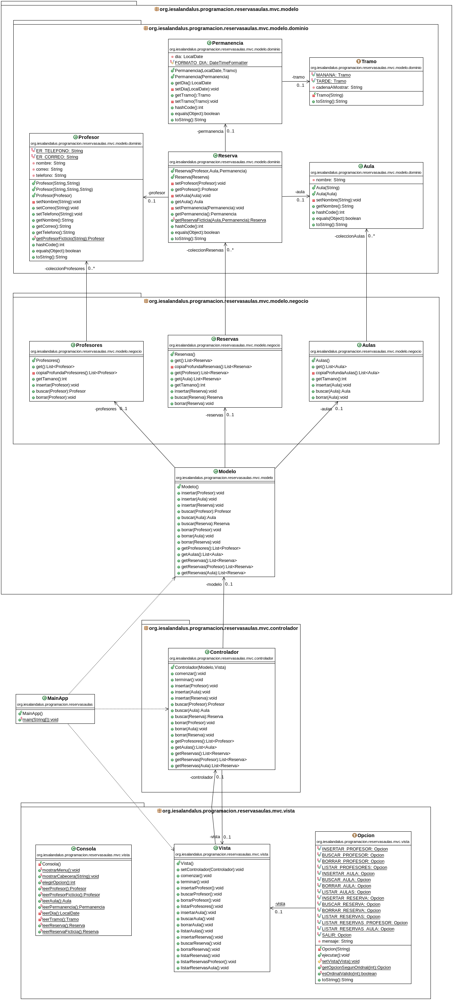

# Ejemplo Tarea: Reservas de Aulas
## Profesor: Andrés Rubio del Río

Desde el IES Al-Ándalus nos acaban de comentar que por favor eliminemos la restricción de tamaño en los datos de la aplicación. Por lo que decidimos utilizar estructuras dinámicas de datos, en concreto `Listas`. Para las diferentes clases del modelo que contienen las colecciones de objetos del dominio (las que están incluidas en el paquete `negocio`) deberemos sustituir los `Array` por `ArrayList` y, cómo no, ajustar los diferentes métodos para que sigan haciendo lo mismo que antes, pero utilizando las nuevas estructuras de datos. Como observarás, los métodos privados que teníamos antes desaparecen ya que ahora no serán necesarios.

También nos han comentado que si podemos hacer que los listados que muestra la aplicación se muestren siguiendo un determinado orden. En concreto nos piden:

- Las aulas se ordenararán por su nombre.
- Los profesores se ordenarán por su correo.
- Las reservas se ordenarán por aula y por permanencia (por su día y tramo). Cuando se listen las reservas por aula se ordenarán por permanencia. Cuando se listen las reservas por profesor se ordenarán por aula y por permanencia.

También nos han pedido que tengamos en cuenta algunas restricciones de integridad más (aparte de la que ya tuvimos en cuenta en el primer spring a lo hora de insertar una reserva):

- Al borrar un aula deberemos borrar todas las reserves asociadas a la misma.
- Al borrar un profesor deberemos borrar todas las reservas realizadas por dicho profesor.

Por tanto, en este **segundo spring** abarcaremos todos estos requisitos.

Se propone seguir el siguiente diagrama de clases:

Cuenta conmigo para cualquier duda que te pueda surgir o cualquier errata que puedas encontrar.

